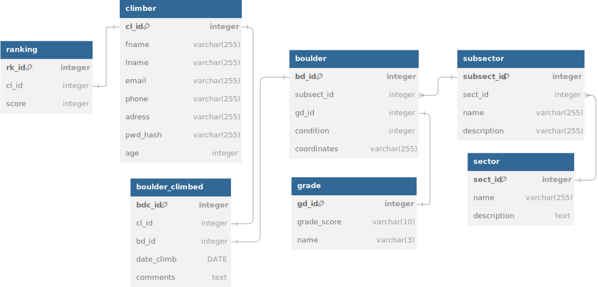

# Welcome to FontaineBleau

Dans le cadre de notre cours sur les bases de données, nous avons choisi de réaliser un micro-projet qui met en valeur la richesse de l'une des zones d'escalade les plus emblématiques de France : Fontainebleau. Ce projet vise à créer une base de données qui représente cette zone de grimpe.

# Quelques métriques

Fontainebleau est un lieu mondialement connu pour ses blocs d'escalade. Avec plus de 50 000 voies répertoriées, réparties en 8 secteurs principaux et 90 sous-secteurs, la complexité et la richesse des données à modéliser en font un choix idéal pour notre projet.

# Particularités

Pour enrichir notre projet, nous avons décidé d'ajouter plusieurs fonctionnalités qui vont au-delà d'une simple base de données. Ces fonctionnalités incluent :

Création de comptes utilisateurs : Les utilisateurs pourront créer leur propre profil afin de suivre leurs activités d'escalade.

Suivi des performances : Les grimpeurs pourront enregistrer les voies qu'ils ont réalisées et obtenir des statistiques personnelles.

Classements et statistiques : Création de classements entre utilisateurs et analyse statistique des zones et des voies.

# Challenge

L'un des défis les plus intéressants que nous nous sommes fixés est de déterminer si la difficulté attribuée à une voie est "réaliste". Cela sera fait en analysant les données des utilisateurs ayant réussi cette voie : leur expérience, leur historique, et leurs performances sur d'autres voies.

# Aspects Modélisés
## Secteurs et Sous-Secteurs :

Les secteurs sont décrits par leur nom et une description.
Chaque secteur peut contenir plusieurs sous-secteurs, qui sont également décrits individuellement.
## Blocs (Boulders) :

Chaque bloc est lié à un sous-secteur et a un niveau de difficulté, un état, et des coordonnées géographiques.
## Grades :

Les grades attribués aux blocs incluent un score numérique et une étiquette descriptive.
## Utilisateurs :

Les utilisateurs possèdent des informations personnelles telles que leur nom, prénom, email, téléphone, adresse, mot de passe, et âge.
## Blocs Grimpés :

Cette table relie les utilisateurs aux blocs qu'ils ont réalisés. Elle contient également la date de la réalisation et des commentaires.
## Classements :

Chaque utilisateur possède un score utilisé pour établir un classement global.

# Motivation

Ce projet est particulièrement motivant car il propose une base simple et accessible, tout en offrant la possibilité de l'étendre vers des aspects beaucoup plus complexes. Par exemple, nous pourrions intégrer des algorithmes d'analyse de données pour prédire le succès d'un utilisateur sur une voie ou modéliser l'affluence dans les différents secteurs.

# Données à disposition

Pour alimenter notre base de données, nous avons plusieurs sources potentielles :

Les données disponibles sur le site officiel de Fontainebleau.

La génération de données fictives à l'aide d'outils comme Mockaroo.

Des sites externes ou communautaires spécialisés dans l'escalade qui répertorient les voies et les secteurs.

Ce projet représente une opportunité idéale pour appliquer les concepts appris en cours tout en travaillant sur un thème concret et passionnant.
# Requêtes souhaités
Dans cette partie nous allons définir les requêtes qui vont être utilisés pour ce projet.
## Utilisateur
- Création d'un compte utilisateur
- Authentification de l'utilisateur
- Modification des informations de l'utilisateur
## Navigation
- Liste des secteurs
- Affichage des sous-secteurs dans un secteur donné
- Affichage des blocs dans les sous-secteurs
- Afficher les détails d'un bloc spécifique
- Afficher le score moyen des personnes qui ont grimpés ce bloc
## Gestion des blocs grimpés
- Nouveau bloque grimpé pour un utilisateur (date, commentaire)
- Voir les blocs qu'un utilisateur a grimpé
- Voir les blocs dans un secteur ou sous-secteur spécifique pour lister les blocs
- Nombre total de bloc grimpé
- Niveau moyen des blocs grimpés par l'utilisateur
## Classement
- Calculer le score d'un utilisateur
- Obtenir le classement des utilisateur
- Classement total score
- Classement par difficulté
## Recherche
- Recherche des blocs par niveau de difficulté
- Recherche des blocs par état
# Schéma de notre modélisation 

